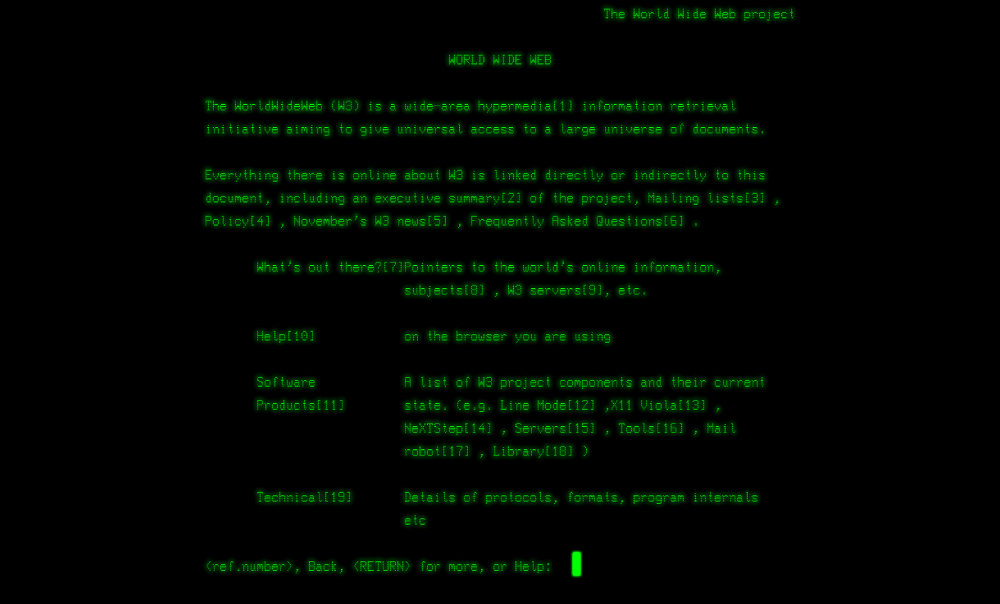

# The internet

## Birth of the internet

**Tim Berners-Lee**, a British scientist, invented the World Wide Web (WWW) in **1989**, while working at **CERN**. The web was originally conceived and developed to meet the demand for automated information-sharing between scientists in universities and institutes around the world.

On 30 April 1993, CERN put the World Wide Web software in the public domain. Later, CERN made a release available with an open licence, a more reliable way to maximise its dissemination. These decisions allowed the web to flourish.

## Interface of the Internet

With the creation of the web, there was also the need for a way to consult the files and resources made accessible. Sir Tim Berners-Lee therefore created a specific software, called the **WorldWideWeb browser**.

### WorldWideWeb


*Screen capture of the first browser developed by Sir Tim Berners-Lee*

The concept of **hypertext** preceded the World Wide Web by decades. But nearly all hypertext systems worked on local files. Tim Berners-Lee wanted to create a system that would work across networks so that people could link from a file on one machine to another file on another machine.

WorldWideWeb wasn't just a programme for browsing files. It was a browser and editor. The introductory text reads:

> HyperMedia Browser/Editor, An excercise in global information availability by Tim Berners-Lee

At its heart, WorldWideWeb is a word processor... but with hyperlinks. And just as you can use a word processor purely for reading documents, the real fun comes when you write your own. Especially when you throw hyperlinks into the mix ! 

There was one major downside to the WorldWideWeb browser: it could only be used on a NeXT computer... Almost nobody had a NeXT machine.

### Line Mode browser

To make the Web more widely accessible, a second browser project was developed at CERN: the Line Mode browser. The Line Mode browser was first released in 1991 and was compatible with most unix / linux systems. Thereby instantly bring the Web to commonly used, much lower powered devices, such as the "line mode" terminals that were used to access mini computers, still common at the time.


*Screen capture of the Line Mode browser*

## Language of the Internet

### HyperText Markup Language

HTML (**H**yper**t**ext **M**arkup **L**anguage) is the code that is used to structure a web page and its content. For example, content could be structured within a set of paragraphs, a list of bulleted points, or using images and data tables. 

HTML consists of a **series of elements**, which you use to enclose, or wrap, different parts of the content to make it appear a certain way, or act a certain way. The enclosing tags can make a word or image hyperlink to somewhere else, can italicize words, can make the font bigger or smaller, and so on.

```html
<p>This is a paragraph, because it is enclosed in a "p" html tag.</p>
<p>This is another paragraph, also enclosed in a "p" html tag.</p>
```


