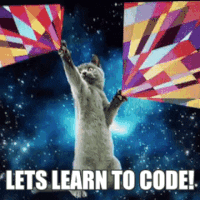
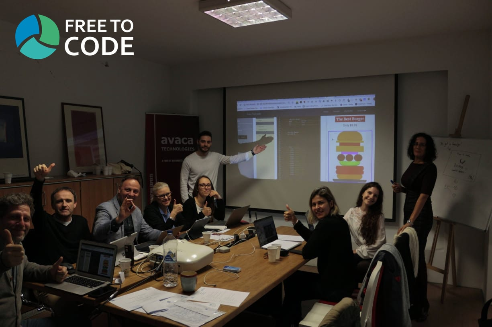
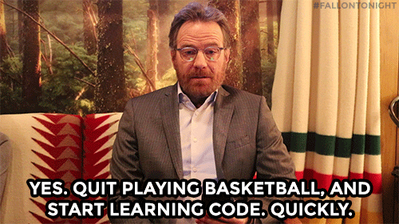

# General Intro to the Course

## Hello World!
Since the computers and the Internet appeared, they have changed deeply how we play, how we communicate, how we work, how we live. Because of these deep changes in our Society, there are many jobs available for people who have learned to code and solve problems by coding websites and web applications.

Perhaps you think you need a University degree in Mathematics and nuclear engineering to be able to code? Not at all! Coding is easy once  you "get it" : even kids can learn programming... Because it actually is a lot of fun! If you ask programmers what they do every day, they will say things like: "it's like playing with Lego Bricks" or "It's like cooking, writing recipes...". 

## What you can expect

The objectives of this training is to allow you to have a try at programming and logical thinking, to see if you too find it fun and something you would like to pursue once you get out of jail. 

This course will have you learn the basics of website making and programming using the 3 main languages of the web: HTML, CSS, and JavaScript. By the end of the training, you will be more than ready to join a coding bootcamp that will help you reach a level in which you can get a real job as a programmer !

## Learn by doing
The best way to learn coding, is just like cooking... By doing it! This is why the course is organized as a series of exercises that you need to succeed in order to move on to the next step. Don't worry about being fast, it's not like school! The system remembers your progress so you don't have to start over from one session to the next.

## ... It doesn't work! I suck at this!!
No, you don't. Coding is about trying until it works. So we all start by failing! Get used to it, failure is part of the learning process. Just keep trying, you will make it!

## A final word from the team

Ready ? Let's go! 

