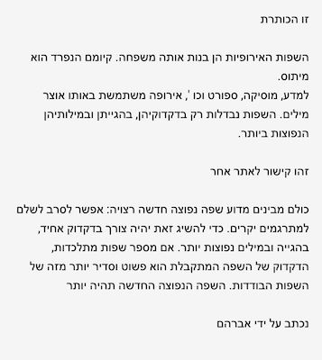
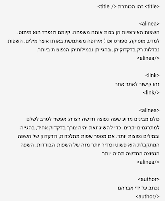
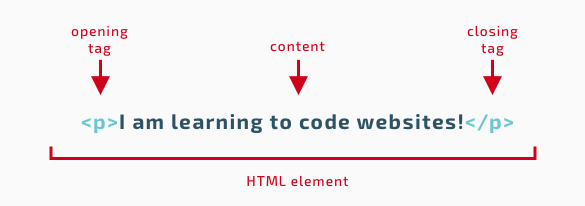
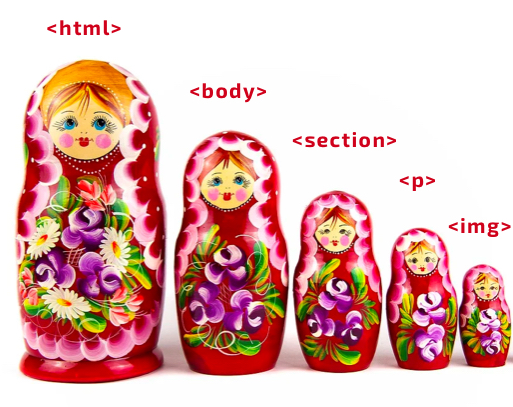

# Intro to HTML

## Why use HTML

Computers and by extension web browsers are inherently dumb. We can't expect a computer to read a text document an make a distinction between titles, paragraphs, links, lists, etc.

Let's put ourselves in the shoes of a computer and take a look at a document you most likely won't understand:



Just like we can't give **meaning** to the text in the above example, computers can't give meaning to the data they get from the web. Therefore we use a **markup language** to add additional meaning to the text. On the web, the markup language we use is HTML or **hypertext markup language**.



By adding some `<tags>` to the document that describe the content, we now have a better understanding of the meaning and structure of the text. The area of linguistics that is concerned with the meaning of text is called **semantics**.
When writing HTML it is important to use the correct HTML tags for your content. This is called writing semantic HTML, and it's importance can't be understated.

## What is HTML?

HTML is not a programming language; it is a markup language that defines the structure and meaning of your content. HTML consists of a series of elements, which you use to enclose, or wrap, different parts of the content to control its semantic and appearance. The enclosing tags can make a word or image hyperlink to a different place on the page or on the internet, or point to a video file (which the browser can then render inside a video player), and so on.  Let's take a simple example:

```I am learning to code websites!```

If we want this statement to stand on its own, we would characterize it as a Paragraph, and thus wrap it as a Paragraph element :

```<p>I am learning to code websites!</p>```

### HTML element (or HTML tag)

Let's look into this paragraph element a bit more closely. What is it made of ?



As you can see, the main parts of an HTML element are :

1. **The opening tag**: This consists of the name of the element (here: a P tag), wrapped in opening and closing angle brackets. This tag states where the element starts — in this case where the paragraph begins.
2. **The closing tag**: This is similar to the opening tag, except that it includes a forward slash (`/`) before the element name. The closing tag states where the element ends. Forgetting the closing tag can lead to errors and strange results.
3. **The content**: This is the content of the element. Here it is just text but it can be anything: items from a list, an image, a video or audio file, a section within the document...
4. **The element**: The opening tag, the closing tag and the content together comprise the element.


#### Nesting elements

Just like russian dolls, HTML elements can be **nested** in other HTML elements.



Let's continue with the HTML element from the previous example.

I would like to put emphasis on the word *code*. To do this I will use the `<em>` element and wrap it around the word I want to emphasize.

```<p>I am learning to <em>code</em> websites!</p>```

In this example the `<em>` element is said to be **nested** in the `<p>` element.

**Important: make sure to close the nested element before closing the parent element or strange things will happen!**
