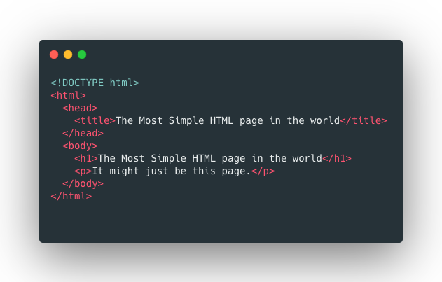

# First HTML document

### Index

- [First HTML document](#first-html-document)
    - [Index](#index)
  - [File Extension](#file-extension)
    - [Code editors](#code-editors)
  - [File Structure](#file-structure)

## File Extension

Your computer knows what application to launch to open a certain file by checking the extension of the file (the last part of the name after the period sign “.”). Here are a few examples:

- Documents ending in **.docx** will be opened by **Microsoft Word**
- Documents ending in **.pdf** will be opened with a **pdf reader**
- A file ending in **.mp3** will be opened with a **music player**

When you write HTML code, you want your code to be read by the **browser**. Your computer will automatically open all files ending in **.html** in the browser. The browser will then convert the HTML code inside the document to a human-readable webpage.

If you want to view the pure HTML code, you will have to use a different type of application to open these documents: a **code editor**.

### Code editors

You could use the default text editor that is installed on your computer to write your HTML files. On Windows for example there is Notepad. That would work just fine as long as you don't write any errors in your HTML code and save it as a **.html** file.

There are also applications created specifically to write code. These applications have built-in functionalities such as code highlighting, indentation of your code, autocomplete, etc. which help a lot with writing code efficiently.

## File Structure

*example of a simple html document*

Let's take a look at the above example of an HTML document.

- `<!DOCTYPE html>`
The first line of a html document starts with the doctype declaration. This line tells the browser what version of html you are using.

- `<html>...</html>`
All your html code will be placed inside the html element. The html element consists of an opening tag: `<html>`, and a closing tag: `</html>`.

- `<head>...</head><body>...</body>`
Inside the html element we have a **head** and a **body** element.
The `head` element comprises information about the document. It will not be visible to the human consulting your web page. The `body` element contains the actual content that will be visible on the website.

- `<title>...</title>`
The **title** element is part of the **head**. As the name suggests, it contains the title for the html page.

- `<h1>...</h1>`
The **h1** element is placed in the **body** of the document. It is one of the 6 section headers in html. (h1-h6). "h" stands for "headline".

- `
...
`
The **p** element or paragraph element is used to display a paragraph of text.

