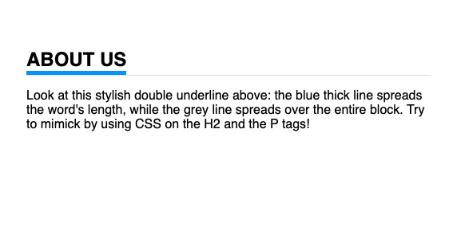

# 1. Exercise: Add some inline CSS

**Instruction**

Here is some HTML content. Use the `style`attribute to :

- make the body have a background color of light gray (use this value: `#DDDDDD`)

- make the paragraph text in blue

- make the strong tags look like they were highlighted, by adding a background color in yellow.

- Underline the heading

- Add a margin bottom of 10 pixels to the List Items (`li` tags) 

- Style the Ordered List (`ol` tag) so that its content is in red.

**Starting Content in the editor**

```html
<body>
<h1>The 7 steps to planning your vacation</h1>
<p>Everyone needs a break once in a while! How about trekking on mountains, or perhaps you're more the "beach" type ? </p>
<p>Here is a memo on how to make sure your holidays are a success!</p>
<ol>
<li>Step 1: <strong>Decide</strong> where to go.</li>
<li>Step 2: <strong>Pick</strong> a time to travel.</li>
<li>Step 3: Take time <strong>off work</strong>.</li>
<li>Step 4: <strong>Find</strong> affordable flights.</li>
<li>Step 5: <strong>Find</strong> a great place to stay.</li>
<li>Step 6: <strong>Call</strong> your credit card companies.</li>
<li>Step 7: Budget consciously for your trip.</li>
</ol>
</body>
```

----

# 2. Exercise: Plan your vacations with <style> !

**Instruction**

Redo the exercise above by removing all inline style and put all style properties in a `<style>`tag. Remember: should it go above the content, or below the content ? If you're not sure, try both and see what works...

**Starting Content in the editor**

```html
<body>
<h1>The 7 steps to planning your vacation</h1>
<p>Everyone needs a break once in a while! How about trekking on mountains, or perhaps you're more the "beach" type ? </p>
<p>Here is a memo on how to make sure your holidays are a success!</p>
<ol>
<li>Step 1: <strong>Decide</strong> where to go.</li>
<li>Step 2: <strong>Pick</strong> a time to travel.</li>
<li>Step 3: Take time <strong>off work</strong>.</li>
<li>Step 4: <strong>Find</strong> affordable flights.</li>
<li>Step 5: <strong>Find</strong> a great place to stay.</li>
<li>Step 6: <strong>Call</strong> your credit card companies.</li>
<li>Step 7: Budget consciously for your trip.</li>
</ol>
</body>
```

---

# 3. Exercise: Canary Islands

**Instruction**

Here is some HTML content describing the Canarian Islands as a cool holidays destination. Your job is to make it look better !

To do the exercises, add all your CSS above the html using one `<style>` tag.  Do each of these exercises in the given order.

1. Change the page background to a `beige` color 

2. Change all the paragraph colour in dark brown (use `saddlebrown` as value)

3. Make it so that all `<strong>`tags are bold and pink

4. Search in the documentation to find out how to style all paragraph so that they have a bottom margin of 20 pixels (use the `px` unit).

5. Style the H1 in italic, and a font size of 32px

6. Style the H2 so that they have a fine grey line underneath (see the documentation for `border-bottom` and use the light grey color `#DDDDDD`) and a font size of 25px

7. Style the paragraphs so that they have a font-size of 16px.

**Content in the editor**

```html
<h1>Welcome to the Canary Islands</h1>
<p>
Scented pine forests, haunting volcanoes, lunar-like landscapes, secret sandy coves, miles of Sahara-style dunes, beach-hugging resorts – the beautiful, unique Canary Islands wear many tantalising hats.
</p>
<h2>Otherworldly Landscapes</h2>
<p>Marvel at the <strong>pine-forested peaks</strong> of Gran Canaria’s mountainous interior, the tumbling <strong>waterfalls</strong> of La Palma or the <strong>subtropical greenery</strong> of La Gomera’s Parque Nacional de Garajonay. Then contrast all this lushness with the extraordinary <strong>bare flatland</strong>s flanking Tenerife’s El Teide, the surreal party of colours glittering across Lanzarote’s <strong>lava fields</strong>, the gentle flower-filled hillsides of El Hierro, and Fuerteventura’s endless <strong>cacti-sprinkled plains</strong>. The Canary Islands' near-perfect temperatures mean that, year-round, you can soak up fantastical, varied landscapes otherwise only found by crossing continents.</p>

<h2>The Great Outdoors</h2>
<p>It's this very diversity that makes outdoor pursuits such an easily accessible and key pleasure of the Canaries. Hike the many footpaths criss-crossing the islands, from meandering coastal trails to challenging mountain treks to tranquil forest walks; go diving or snorkelling in blissfully warm waters inhabited by more than 350 species of fish (and the odd shipwreck); or pump up the adrenaline by riding the wind and the waves – kitesurfing, windsurfing, surfing and paragliding are all big here. Then slow things down with horse rides, boat trips, kayaking and paddle-boarding jaunts or beachfront yoga.</p>

<h2>Art & Architecture</h2>
<p>
Contrary to many expectations, the Canary Islands are immensely rich in both original art and architecture – sometimes you just need to know where to look. The spectacular surrealist canvases of world-acclaimed painter Óscar Domínguez grace his Tenerife homeland; the enormous abstract sculptures of Martín Chirino are impossible to miss on Gran Canaria; and César Manrique's inspired 'interventions' pop up all over Lanzarote (and beyond). Everywhere, seek out the emblematic wooden balconies, leafy internal patios and cheerily painted facades that typify vernacular Canarian architecture, and pop into charming palm-shaded churches, many of which date back several centuries.</p>
```

# 4. Exercise: Use classes to differentiate elements and style them differently

**Instruction**

Let's make the last exercise look better, using more advanced techniques. Use the CSS Cheat Sheet and the Documentation to find the proper syntax. The wording is made to give a hint at the correct property name).

1. Style the body tag so that it has a padding of 30px and a light grey background color (use these values: Red: 220, Green: 220, Blue: 220)

2. Style all Paragraphs so that their font is 16px, with a line height of 120% , with a dark (but not black) color (use these values: Red: 25, Green: 25, Blue: 25)

3. Add a class to the paragraph tag underneath the H1 tag, with a value of "introduction" (the syntax is like this: `<p class="classname">`and in CSS, you can mention that it is a class by adding a period in front of it, like this  `.classname`  (If you are stuck, make sure to read about "Selectors" in the Documentation or in the lessons)

4. Style that "introduction" paragraph by setting its font size at 140% . Change the line height to 200% and give it an "italic" font style.

**Content in the editor**

--> same as exercise 3.

# 5. Exercise: borders

**Instruction**

Look at this stylish double underline below : the blue thick line spreads the word's length, while the grey line spreads over the entire block. Try to mimick by using CSS on the H2 and the P tags!

**Tip 1:** You will need to use the display property on the `h2`element. Check the documentation to find out which value you will need. (Standard value is `block` which is why the line covers the whole page.)

**Tip 2:** Find a way to set the font family to 'sans-serif'.

**Tip 3:** Color: #2A99FB.



**Content in the editor**

```html
<body>
    <h2>About Us</h2>
    <p>Look at this stylish double underline above: the blue thick line spreads the word's length, while the grey line
  spreads over the entire block. Try to mimick by using CSS on the H2 and the P tags!</p>
</body>
```
