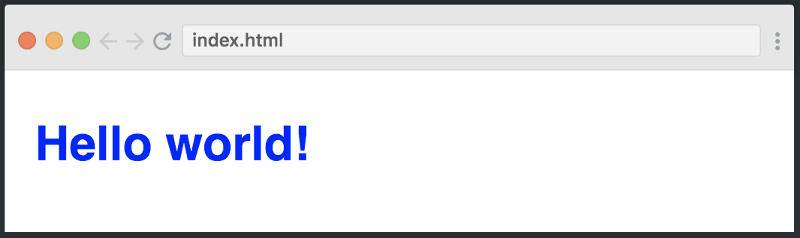

# CSS introduction

In our previous journey, we have discovered the power of HTML. As you've seen, HTML was created to describe the content of a web page, like:

```html
<h1>This is a heading</h1>

<p>This is a paragraph.</p>
```

But you might have noticed that there is no color at all, it just looks like a plain word document. Which is boring to look at.

That's because on top of their HTML, these pages are using another language, called CSS, which job is to make the html look visually better.

In other words, CSS allows us to turn this:


Into that:


## What is CSS?

- **CSS** Stands for **C**ascading **S**tyle **S**heets
- CSS describes how HTML **Elements** are to be displayed on screen.
- It can control the layout of multiple pages at once.

In short, CSS is what makes our web pages look good and presentable.
It's a must-have skill for any web developer out there.

## The CSS Syntax

Look at this schematic, which sums all how to write CSS in a way that the browser understands it.


As you can see, there are fancy words here. Don't panick, there won't be much more :-)

"**selector**" indicates which element(s) of your HTML file should receive the instructions. It points to the HTML element you want to style. In this example, all `<h1>` tags on the html page will receive the CSS properties assigned to the `h1`css selector. 

The **declaration** block contains one or more declarations separated by semicolons.

Each declaration includes a CSS **property name** and a **value**, separated by a colon (this character `:`).

A CSS declaration always ends with a semicolon (`;`), and declaration blocks are surrounded by curly braces. Example:

```css
h1 {
  color: blue;
  font-size:12px;
}
```

## Getting started

There are three  ways of implementing CSS in our web-pages.

### 1. Inline CSS

Firstly we can include CSS directly in our HTML elements.
To accomplish this, we make use of the `style` attribute, and write CSS code inside its value (the part in between the quotes). Example :

```html
<h1 style="color: blue"> Hello world! </h1>
```

As you see, the css instructs the browser to use the color blue to render the `h1`tag. Easy, isn't it ? And you can combine several properties. For example, let's make it blue and bold:

```html
<h1 style="color:blue;font-weight:bold">Hello world!</h1>
```



Easy again! As you can see, you can add up properties using a semicolon (the character `;`) to separate them so the browser does not get confused.

We could add many more properties inside of this method but  it can get really messy in our HTML file so it's not really recommanded. The next two methods are much cleaner...

### 2. The <style> block

Another way to include CSS is by using the `<style>` tag inside of our `head` section of our HTML page.

```html
<head>
    <meta charset="UTF-8">
    <meta name="viewport" content="width=device-width, initial-scale=1.0">
    <meta http-equiv="X-UA-Compatible" content="ie=edge">
    <title>CSS is awesome! - BeCode</title>

    <style>
        h1{
            color:blue;
        }
    </style>
</head>
```

We just found a solution to not mix our HTML with our CSS, but our styling is still inside of our HTML file.   
Maybe, there is a better way to include our CSS..? Well, yes there is!

### 3. External CSS

Like the name gives it away, we will have some **external** CSS file(s), which we will import inside the `<head>` of our HTML page.

```html
    <head>
        <meta charset="UTF-8">
        <meta name="viewport" content="width=device-width, initial-scale=1.0">
        <meta http-equiv="X-UA-Compatible" content="ie=edge">
        <title>The best way! - BeCode</title>

        <link rel="stylesheet" type="text/css" href="resources/css/style.css">
    </head>
```

As you can see, we use a `<link>` tag this time to make a connection with our CSS file.
This link tag will need a few attributes to work, the `rel=" stylesheet"` specifies the relationship between the HTML and CSS file, the browser knows now that we are trying to link a Stylesheet (CSS file).
The `type=" text/CSS"` will tell the browser what kind of resource we are linking. It's not an obligation to use this, but we recommend using it to avoid any problems in the future.
Last but not least, the `href="resources/css/style.css"` is our path that the link will use to find the document.   

Having an external CSS file is the most recommended way to do, because it "separates concerns" : the HTML file is for content, the CSS file is for decoration !

#### Here is an example of our folder structure:


Inside of our CSS file we have written the following:

```css
    h1{
        color:blue;
    }
```

This will give the same output as our result in example 1, the benefit of this is that our CSS is seperated from out HTML **and** we can import this CSS file in multiple pages at once!

## Working with colours

Colours are a big part of how things look. And we, humans, love colour ! 

There are many millions of colours available in Nature.... Which was quite a challenge to transfer in the digital world of computers.  First, there were only a few colours available, using predefined colour names (like "red", "blue", "beige", "chocolate")... 

### Named colours

A set of standard color names have been defined, letting you use these keywords instead of numeric representations of colors if you choose to do so and there's a keyword representing the exact color you want to use. Color keywords include the standard primary and secondary colors (such as `red`, `blue`, or `orange`), shades of gray (from `black` to `white`, including colors like `darkgray` and `lightgrey`), and a variety of other blended colors including `lightseagreen`, `cornflowerblue`, and `rebeccapurple`.

It's nice to know they exist, but you will feel fastly limited by having only 140 colours.. So let's rather move on to the next way to express colour values...

### The RGB system

Quickly computers became more powerful and able to manipulate millions of different colors, using a mix of the fundamental 3 colours of the screen: Red, Green and Blue, which is known as the "RGB system". 

```css
p{
color: rgb(255, 0, 0);
}
```

This says "I want the maximum of Red (maximum is 255), no green (0), and no blue (0)... Leading to a full bright red color.

This is exactly the same as 

```css
p{
color: red;
}
```

So if, for example, you really want that specific shade of blue that describes the Scottish sky in Spring, then you need to find its correct translation in the RGB system.

```css
p{
color: rgb(0, 182, 255);
}
```

### Transparency !

You can also use a fourth value, to set the "alpha", which means "transparency" (or "opacity" if you prefer). Its value goes from 0 (totally transparent, the tag would be invisible) to 1 (fully opaque). 
Instead of `RGB` we use `RGBA` to add the transparent layer to our colour. 

So let's say you want an orange square with 60% transparency, you would do this:

```css
div {
  width: 100px;
  height: 100px;
  background-color: rgba(255, 221, 0,0.6);
}
```

### The Hexadecimal system

For your information, there is yet another way to express the colour values, using the Hexadecimal system. In that system, `red` for example is expressed as `#FF0000`  , `black`is `#000000`and white : `#FFFFFF`.

Hexadecimal system functions from values going from 0 to 9 and continues to A up to F for a total of 16 values. By using 6 Hexadecimal values, you are able to express 256 millions of colours.

The first 2 digits describe the value of Red, the next 2 the values of Green, and the last two the values of Blue.

Just know that it exists and that you will be able to use it if you want. We will not really dig into that in this training.

## Playing with borders

By default, without styling, each tag is rendered as a rectangle which background and borders are **transparent**. It does not have to stay that way!

Here is a visual representation of that rectangle, called the "box model".


This image represents how you can play with `border`, `margin`, `padding` to style any HTML tag!

Okay to explain this a little deeper, let's get our hands dirty!

**Create an HTML file and copy these lines in our body:**

```html
<div class="box1">
  <div class="box2">
  </div>
</div>
<div class="box3">
</div>
```

**Next create an CSS file and copy the following lines inside of this:**

```css
.box1{
  width:200px;
  height:200px;
  border-top:1px solid red;
  border-right: 1px solid black;
  border-bottom: 2px dotted green;
  border-left: 2px dashed green;
  padding:100px;
  padding-right:50px;
  background-color: yellow;

  /*--We will cover this later--*/
 display:inline-block;
 /*----------------------------*/
}

.box2{
  width:200px;
  height:200px;
  background-color:red;
  /*--We will cover this later--*/
  display:inline-block;
  /*----------------------------*/

}

.box3{
  width:100px;
  height:100px;
  background-color:green;
  margin-left:200px;
  /*--We will cover this later--*/
  display:inline-block;
  /*----------------------------*/
}
```

That sure won't look *exactly* pretty, but that's not the concern yet.

As you can see, you can specify each border of the rectangle using 3 parameters: the **thickness** of the line (here, in pixels), the line **type** (`solid`,  `dashed`, `dotted`), and its **colour**.

Now while you are at it, try to figure out the difference between `padding` and `margin`.
Play with it's values, we will discuss this in group later on.

### Borders can be used to turn rectangles into a square!

As you learn CSS, you will see that CSS is full of hacks and tricks. One really useful one is that you can turn an image like this:

 

  into that:

  

  Here is the one property that makes it possible:

```css
    border-radius:50%;
```

You'll get a chance to experiment with it in the exercises....

## Comments in CSS

Comments are used to explain the code, and may help when you edit the source code at a later date.  Comments are **ignored by browsers**.

A CSS comment starts with `/*` and ends with `*/`:

```css
/* This is a single-line comment */
p {
  color: red;
}
```

You can add comments wherever you want in the code:

```css
p {
  color: red;  /* Set text color to red */
}
```

Comments can also span multiple lines:

```css
/* This is
a multi-line
comment */

p {
 color: red;
}
```

## Congratulations!

You just discovered the magic of CSS. Now let's put our knowledge to the test by doing a few exercises!
