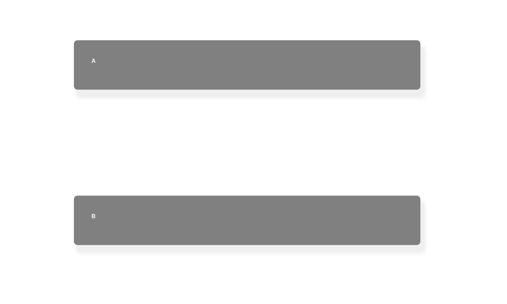

## Position properties

### Set up

Copy the following code in your editor:

```html
<html>
<head>
    <meta charset="utf-8" />
    <style>    
    body{
      height:3600px;
      padding:0;
      margin:0;
      font-family:sans-serif;
    }
    /* Put your styling here */
    </style>
</head>
<body>
<!-- put your content here -->
    <main>
      <div class="cases">
        a
      </div>
      <div class="cases">
        b
      </div>
      <div class="cases">
        c
      </div>
      <div class="cases">
        d
      </div>
      <div class="cases">
        e
      </div>
      <div class="cases">
        f
      </div>
      <div class="cases">
        g
      </div>
    </main>
</body>
</html>
```

Now re-create this styling as good as possible:



Now make it so that if we scroll down, each case collapses onto eachother. (Leave 20px space between the **top** and the cases.)
