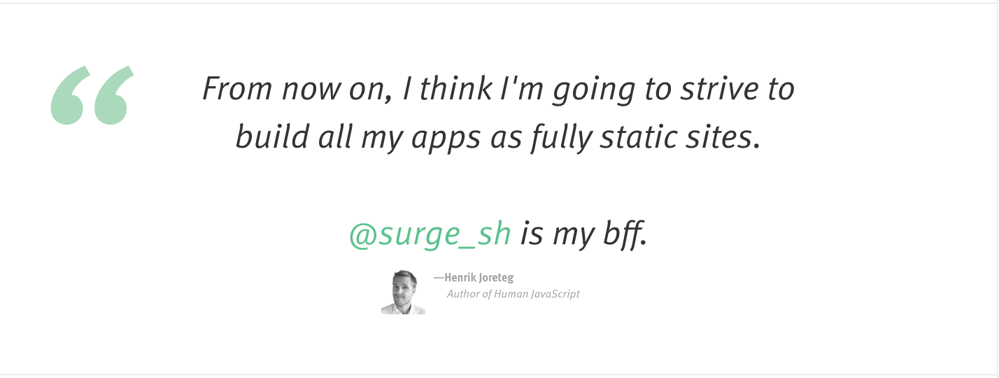

# CSS Integration exercises

**Instructions**

You work in a Web Design agency as Frontend Integrator. The UI Designer provides you with images representing a high-fidelity mockup of the website's interface components. 

Your job is to reproduce in html and CSS each of these components. Each UI component has been validated by your customer. It's therefore really important that the end-result looks as close as possible to the mockups.

Look at this image: 

Reproduce this interface as close as possible using html and CSS. You have to reach the closest "pixel-perfect" version you can. Ideally, we should not see any difference between the image mockup and your result, without using any image. Images are only accepted for illustrations, when there is no CSS alternative.

**Color:** #FFFFFF.

**Tip**: always start with the content: so focus on the html first, without worrying to much about CSS. When your HTML is good, the move on to CSS. This way, you will only add classes when required by the CSS, which is a good practice.

The CSS has to be in a `<style>`tag, no inline CSS.

**Content in the editor**

```html
<html>
<head>
    <meta charset="utf-8" />

    <style>
/* Put your styling here */
</style>
</head>
<body>
<!-- put your content here -->
</body>
</html>
```
