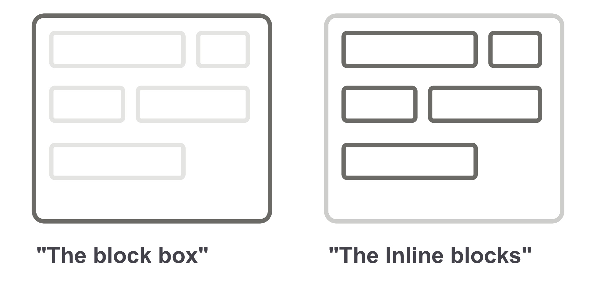
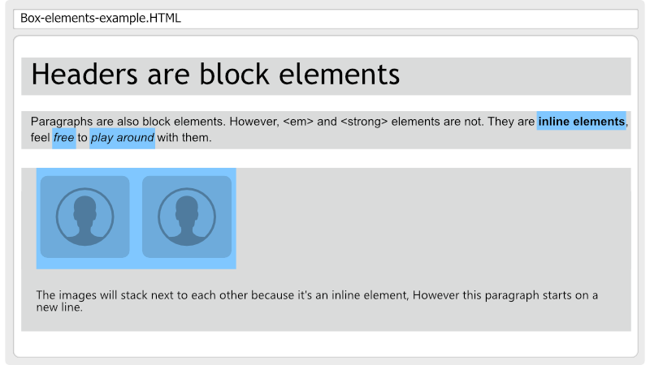
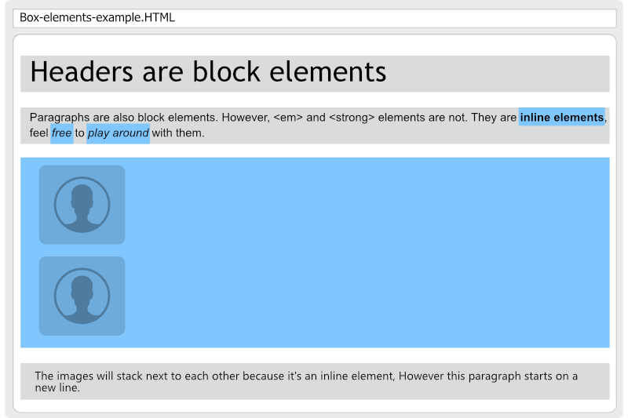
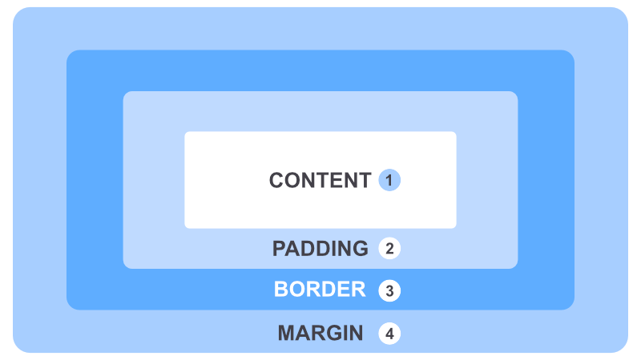
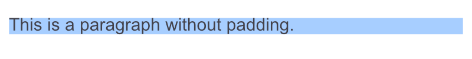
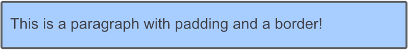
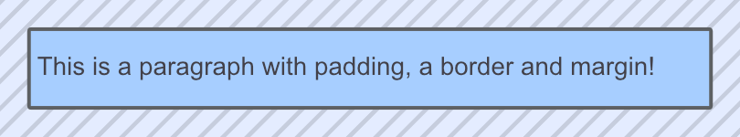
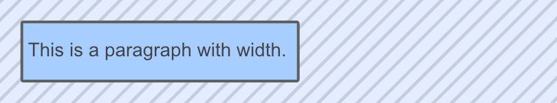

# CSS Positioning

The big part of your job is to place elements on the screen, and control how they should adapt to the adjacent content as well as to the screen size (mobile phone or Desktop computer). In a word: **positioning**

CSS offers several ways to control the positioning of the elements on the screen. Let's start by giving you an understanding of how the element itself is laid out.

## Boxes and blocks

You can imagine each HTML element as a box, we have 2 different versions of these so called "boxes".

- A block box
- A Inline box

Take a look at this visual representation of the difference between a block and an inline element.



Each HTML element has a default type of box, you will see that not all elements share the same box type in the end!
For example `<div>`, `<h1>`,`<p>`, `<ul>`,... are **block elements** whilst ``, `<a>`,... are **inline elements**.

These so-called _" boxes"_ are important for the flow of our webpage.

## Block elements

A block element usually takes the whole width of the **parents container**. As a result, it will force the next block element onto a new line, each block element will appear below the other.

The **height** of a block element will always be decided by its **content** - if the text doesn't fit on the screen, its default behavior is to _collapse_ the text onto a new line.

## Inline elements

Inline elements behavior is much different than Block elements, they are used to style items inside block elements. Unlike the Block element, which takes the full parents width, The Inline element width is always based on its content.

Take a look at the visual below - You will see that the grey parts (block elements) take the full width of the body. Whilst the blue parts (inline elements) only take the width of its content.



### Changing box type behavior

In CSS we are fully in control of how our elements should display, this means we can change our elements default behavior as well!
Maybe you want your images to stack below each other, that can be easily done by using the **display** attribute.

```css
img {
  display: block;
}
```



## The CSS Box Model

There is one thing that the `block` and `inline` elements have in common - and that is the `CSS Box Model`. What is that I hear you say, another box? Yep, well not really - it's still the same box we were talking about earlier. But maybe it's time we take a closer look at what is included in this so-called _"box"_.

While it maybe sounds and looks complicated, it's easy to understand. This box model is used to calculate how much space there is between/inside each element or if needed, to add a border around the element.

> Maybe you understand now why people sometimes say - _HTML is like building lego._

### Let's take a look to the box model visually



1. **Content**: This is what matters to most the developer that writes HTML, this is the only part that has a semantic value. The next parts are purely visual for the box model.
1. **Padding**: This will decide how much space there is between the content and its border.
1. **Border**: A-line (by default transparent) between the padding and margin.
1. **Margin**: The space between this element and its surrounding elements.

## Padding

We've already seen the content part, so let's move one level up to `padding`. This property will decide how much padding there will be for the selected element:

Here we have an example:



```
p {  padding: 10px;}
```


As you can see the blue background behind the p element has increased. And that because we told our CSS to increase the padding by `10px`! Now you see it's doing 10px for all sides, but sometimes we want to style one side only or have different values everywhere.

We can easily do this with the following:

```css
p {
  padding-top: 20px;
  padding-bottom: 20px;
  padding-left: 10px;
  padding-right: 10px;
}
```


> You can see the slight difference of the top and bottom padding compared to the left side.

_Padding works on `block` and `inline` elements._

## Borders

Now the next property of the box model is the Border. By default, most elements have a transparent border.
If you would like to assign a border to your element, you would have to follow this CSS syntax: Specify the width of the border, then which type of border it should have, and last its color.

Let's add a border to our previous padding example!

```css
p {
  border: 4px solid #5d6063;
}
```



Just like `padding`, there are `-top`, `-bottom`, `-left`, and `-right` variants for the `border` property:

```css
p {
  border-bottom: 4px solid #5d6063;
}
```

This would only draw 1 border on the bottom of the element.

_Borders works on `block` and `inline` elements._

## Margins

We have reached our last Box Model property, `margins`. Margins are the transparent spaces around an element, so don't confuse it with padding. Padding takes care of spacing inside an element where margin pushes away other elements around the selected element.

```css
p {
  padding: 20px 10px 20px 10px;
  margin: 20px;
}
```



And just like padding and borders, you can target one or more sides to make changes on.

_Margins works only on `block` elements._

## Changing widths or heights

Up until now, we let the browser decide how much width our elements should be, but sometimes you want to set the width yourself. Maybe an image is way too big, or there is text that should only cover 20% of your screen. For this, we can use the `width` and `height` properties within CSS. This will change the default width of your box's content.

Let’s give our paragraph a width of 200px.

```css
button {
  width: 200px;
}
```



Instead of taking the full browser width, our paragraph is now 200 pixels, but it hugs the left side of our page...

_Width/height works only on `block` elements._

## Centering with auto-margins

To avoid or element sticking to the left, we can use the `auto-margins` value inside our margin property. This will automatically make the space around your block element and divide it equally on the left and right sides.

We can center our paragraph as follows:

```css
p {    
  margin: 20px auto;
}
```


> This will only work when a width has been set.

# Summary

- Everything inside a HTML page is a **box**.
- Boxes can be **inline** or **block** elements.
- Those boxes have content, padding, **borders**, and **margins**.
- Once you know the Box Model, it's easier to master layouts of web pages.

Like the last chapter, the CSS properties we just covered might seem simple—and they sort of are. But, start looking at the websites you visit through the lens of the CSS box model, and you’ll see this stuff literally everywhere.

All right, let's go ahead and continue learning by doing a few positioning challenges using 3 techniques: Display, Position, and Flexbox!
