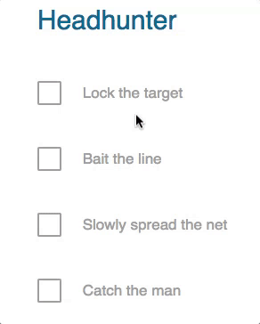
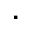
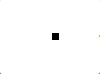
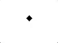

# Small CSS animations series BONUS - 08

In these series of exercises you have to replicate a series of elements.

Make an exact copy of the examples and write your own HTML and CSS!

## SPECIAL

For this one we are going to create a series of checkbox that will have this animation when getting checked:



## Before you start

Please copy and paste this code inside your editor:

```html
<html>
     <head>
     <meta charset="utf-8" />
         <style>
         /* Put your styling here */
         </style>
 </head>
<body>

<!-- put your content here -->

</body>

</html>
```

## Animated component:

### The arrow:

#### Step one:



#### Step two:



#### Step three:



#### Step four:


### The checkbox:

#### Step one:


#### Step two:


#### Step three:


## Now finish it!


