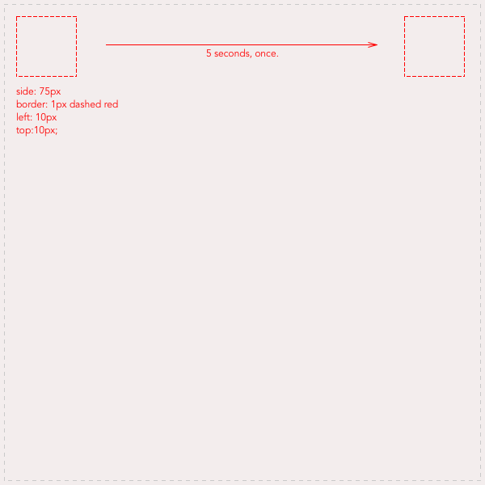
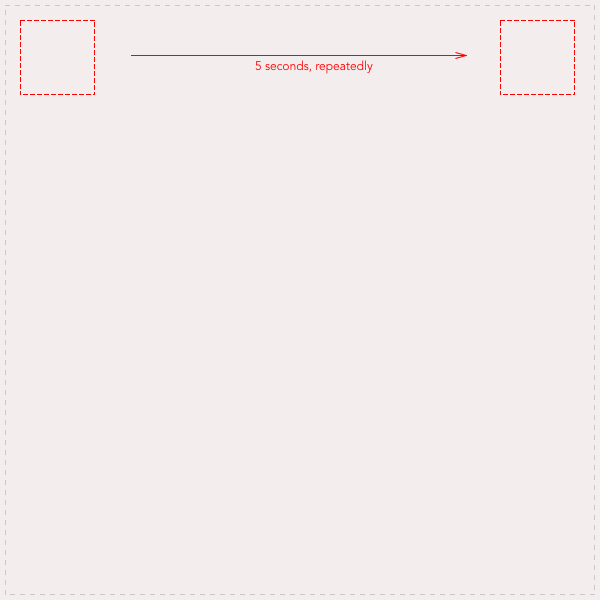
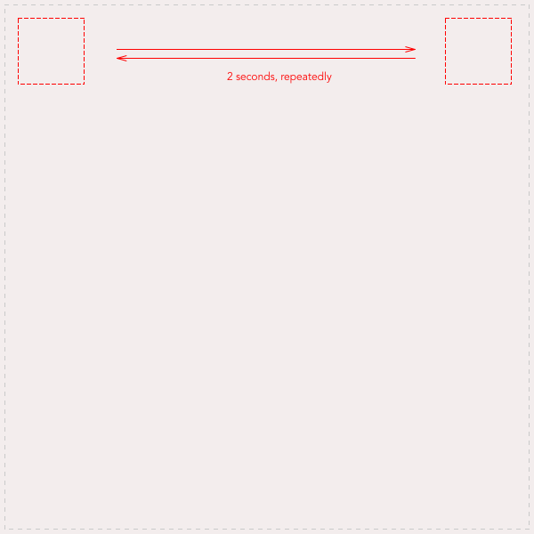

# Learn CSS Animations

## The exercise

In this exercise, you will build a complex animation, step by step.  
As often with CSS, this is an exercise in precision and accuracy (and a zest of dementia, because... CSS). To give you a reliable visual assistant, you will thus use a technique that could be called "the image background guide Technique". 

**Tip: the image background guide Technique**: for each step of the exercise, use the images  as your body's background image (with a slight opacity perhaps?) to help you style precisely.  

Of course, when done, remove the background image for a cleaner look.

```html
<div id="stage" style="background: transparent url(./images/css_animation_exercise_stage.png) 0 0 no-repeat;">
```

- Create the stage: add a div with the id "stage", style it so that it appears exactly like this image, and in the horizontal middle of your index page.   


- Add a div with an id "hero".
- Style the `#hero` so it looks exactly like this: 


Now, construct the animation step by step.

## Step 1

Move the hero to the right, one time.  



## Step 2

Move the hero to the right, in 5 seconds, indefinitely (loop animation).  

[](./images/css_animation_exercise_2.png)

## Step 3

Move the hero to the right, then to the left, in 2 seconds, indefinitely (loop animation).  

[](./images/css_animation_exercise_3.png)

## Step 4

[](./images/css_animation_exercise_2.png)

## Step 5-7

You got it ? Ok, now follow these instructions. Think "pixel-perfect".  

[](./images/css_animation_exercise_4.png)

## 

## Done ?

Bravo ! 


