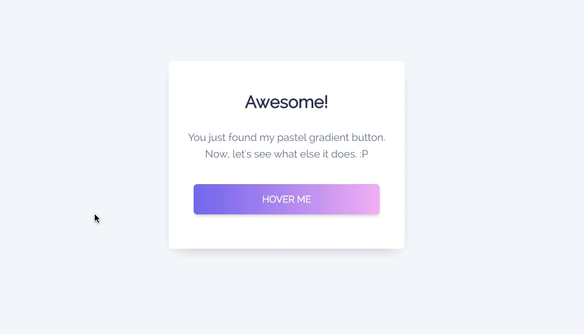
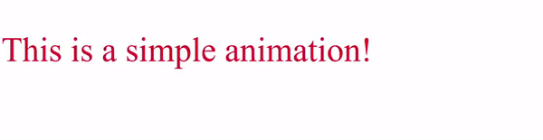
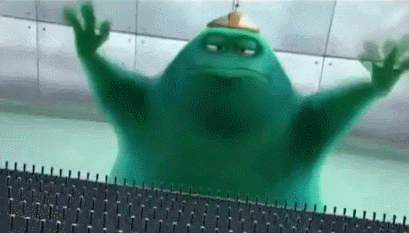

# CSS animation & Transitions

We are almost through the CSS part, well done! But there is still something that we have not covered yet. What if you want to move elements around? Or what if you want to animate your beautiful button just like the example below:



Well, all of this is possible with `Transitions` and `Animations`!

## Transitions

Without transitions all changes on a CSS element will happen instantly. Let's imagine we use a `:hover` pseudo-class. Normally the effects will happen as soon as the mouse hovers over the element. But once we add transition properties and values, we can create a smooth transition between the two phases.

You can use transitions with widths, heights, transforms, colors...

### How to create a transition in css?

Have a look at the following CSS snippet:

```CSS
button {
  color: red;
  transition: color 0.5s ease-in-out 1s;
  /*transition: (property) (duration) (transition-timing-function) (delay)*/
}

button:hover{
  color:blue;
}
```

This chunk of CSS code gives a button a font color of red, and when we hover it, it will pause for 1 second then smoothly changes the color red to blue over a period of 0.5 seconds.

#### Let's go over the different values

- **Property**: What do you want to animate? Width,height,color,...
- **Duration**: How long should the transition last? 0.5 seconds, 1 second, ...
- **transition-timing-function**: What is the speeds of the transition (see below for more info).
- **Delay**: How much delay should there be when the transition triggers

You can use transitions without using all properties, if you don't assign any values, it will use its default value.

These are the default values:

```CSS
  transition: all 0 ease 0;
```

As you can see, in order for your transition to work you can leave all values empty except from the **duration** value. If you do not set the duration, there will be no smooth transition.

**Note:** The `all` value will animate all different properties if they change. While this can be easy to animate everything quickly, it can lead into strange and unwanted behaviors.

### Transition timing

Sometimes animations feel boring and lifeless, if you want to make changes to that, you most likely want to look into the `transition-timing-function`.

This will decide if your the _"rythm"_ of your animation. Does it start slow or fast.. Does it end slow..
Not only is this better for the eye, it makes an animation feel more natural.

Take a look at this animation value sheet:


> Leanndro www.leanndro.com - Animation Value Graph - Timing. Source: http://spungella.blogspot.com/2016/03/animation-value-graph-timing.html March 17, 2016

- The top row shows you the `curve` and animation behind each value.
- The bottom one shows animations of when we would manipulate this curve.

Amazing how we can change the feeling by changing a curve, right?

Feel free to experiment with other _easing functions_ (search for them in the Documentation - remember searching is part of the job of a professional developer! ;-) )

## Animations

You would think an animation is the same as a transition, they both change the property values. Whilst the transition can change over two states, an animation can transition over as many states as you want.

In order to use CSS animations you have to use _"keyframes"_, which contains an elements property and ofcourse the value to what it should change to.

### How do we use keyframes?

First of all, we have to design the keyframes animation, this can be achieved by simply creating a `@keyframes` css rule, next give it a name so we can call it later in our elements.

The next step is to define `from` and where `to` our animation should go. You will see it the following example,

- That we start `from` a `font-size` of `50px` and the `color` `red`.
- And that we go `to` a `font-size` of `100px` and the `color` `blue`.

```css
/* The animation code */
@keyframes test {
  from {
    font-size: 50px;
    color: red;
  }
  to {
    font-size: 100px;
    color: blue;
  }
}

/* The element to apply the animation to */
p {
  color: red;
  animation: test 4s infinite alternate ease-in-out;
}
```

**This would result something like this:**



As you can see use "`from`"(0%) and "`to`"(100%) - which is only 2 states. But as I have told you earlier, it's possible to animate many more states.

This can be achieved by using percentages. Take a look at the following example:

```css
/* The animation code */
@keyframes test {
  0% {
    font-size: 0px;
    color: red;
  }
  25% {
    font-size: 100px;
    color: pink;
  }
  50% {
    font-size: 30px;
    color: green;
  }
  75% {
    font-size: 120px;
    color: yellow;
  }
  100% {
    font-size: 0px;
    color: blue;
  }
}

/* The element to apply the animation to */
p {
  color: red;
  animation: test 4s infinite alternate ease-in-out;
}
```

**Result:**


As with transitions, you will have to assign a duration value, otherwise no animation will be played.

## Conclusion

Animations are pretty cool and fun, isn't it? I could tell you much more about transitions and animation, but that is not the point here! Let's dive into the documentation and get our hands dirty! Feel free to experiment and break things!


Source: https://tenor.com/view/monsters-inc-typing-group-chat-is-lit-gif-11492598

