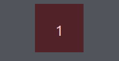

# CSS animation & Transitions


## Transitions


CSS transitions allows you to change property values smoothly, over a given duration.

For example if you hover over a button, the color changes instantly without adding a transition property.

With the transition property and the correct values, we can get smooth transitions between widths, heights, colors, ...


To create a transition effect, you must specify two things:

- the CSS property you want to add an effect to
- the duration of the effect

**Note:** If the duration part is not specified, the transition will have no effect, because the default value is 0.


The following example shows a 100px * 100px red <div> element. The <div> element has also specified a transition effect for the width property, with a duration of 2 seconds:


```css
div {
  width: 100px;
  height: 100px;
  background: red;
  transition: width 2s;
}
```


The transition effect will start when the specified CSS property (width) changes value.

Now, let us specify a new value for the width property when a user mouses over the <div> element:


```css
div:hover {
  width: 300px;
}
```


When we hover over the div, it's width will increase by 200px over a duration of 2 seconds.


## Transition timing

But the animation looks a bit flat, right? That's because in animation terms this animation is linear.
Which is basically a flat line, if we are honest with our selves, we rather look at rounded lines/shapes rather than a boring flat line.

It also makes your animations more natural..


Here is an example of how we can add a transition timing to our transition:

```css
div{
    width: 100px;
    height: 100px;
    background: red;
    transition: width 2s; /*You can also just write transition: width 2s ease-inout-*/
    transition-timing-function: ease-in-out;
}
```


## Animations

An animation lets an element gradually change from one style to another.
You can change as many CSS properties you want, as many times you want.

To use CSS animation, you must first specify some keyframes for the animation.
Keyframes hold what styles the element will have at certain times.


### The @keyframes Rule

When you specify CSS styles inside the `@keyframes` rule, the animation will gradually change from the current style to the new style at certain times.

To get an animation to work, you must bind the animation to an element.

The following example binds the "example" animation to the <div> element. The animation will last for 4 seconds, and it will gradually change the background-color of the <div> element from "red" to "yellow":


```css
/* The animation code */
@keyframes example {
  from {background-color: red;}
  to {background-color: yellow;}
}

/* The element to apply the animation to */
div {
  width: 100px;
  height: 100px;
  background-color: red;
  animation-name: example;
  animation-duration: 4s;
}
```


**This would result something like this:**


**Note:** The `animation-duration` property defines how long time an animation should take to complete. If the `animation-duration` property is not specified, no animation will occur, because the default value is 0s (0 seconds).


In the example above we have specified when the style will change by using the keywords "from" and "to" (which represents 0% (start) and 100% (complete)).

It is also possible to use percent. By using percent, you can add as many style changes as you like.


The following example will change the background-color of the <div> element when the animation is 25% complete, 50% complete, and again when the animation is 100% complete:


```css
/* The animation code */
@keyframes example {
  0%   {background-color: red;}
  25%  {background-color: yellow;}
  50%  {background-color: blue;}
  100% {background-color: green;}
}

/* The element to apply the animation to */
div {
  width: 100px;
  height: 100px;
  background-color: red;
  animation-name: example;
  animation-duration: 4s;
}
```


**Result:**  




## Conclusion

I could tell you much more about transitions and animation, but that is not the point here! Let's dive into the documentation and get our hands dirty!


