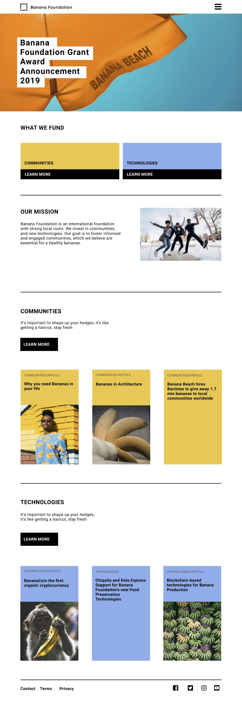

# Final Challenge

This is your final assessment. If you can solve it, you will receive a certificate that testify on your ability to start a full training on Frontend Web Development and become a professional web developer (frontend).

**Instructions**

The company owner approaches you with a design for the Banana Foundation. He asks you to build a website that looks EXACTLY like it. to buildCompany. Reproduce as accurately as possible the following layout. 

You will find images necessary to build the interface in the project folder.

Remember: 

1. Plan your work

2. Divide the plan into smaller steps

3. Start with the content (the HTML) without worrying about the look

4. Debug (fix poblems and repeat from step 1).

**Color codes & font family :**

- yellow: rgb(242, 201, 76)

- blue: rgb(131, 175, 237)

- font family: **Roboto**

**Starting content in the Editor**

nothing
